# Architecture Diagrams

All system diagrams in one reference. These show how the components connect, how data flows, and how lifecycle events sequence.

---

## 1. Repository Structure

The `~/agents/` monorepo contains all Claude Code configuration alongside standalone agent projects.

```
~/agents/                                # single git repo
  claude-config/                         # Claude Code configuration (symlinked into ~/.claude/)
    agents/          (12 .md files)      # Agent definitions
    commands/        (16 .md files)      # Slash commands
    rules/           (12 .md files)      # Always-loaded + path-scoped rules
    hooks/           (10 .py files)      # Lifecycle hooks + shared modules
    skills/                              # Workflow skills (linked from ~/.claude/skills)
    snippets/                            # Shared prompt snippets (verify-commands.md)
    scripts/                             # Validators (validate-hooks.py, validate-paths-globs.py)
    templates/       (8 entries)         # Prompt + scaffold templates
    settings.json                        # Hook registrations, plugins, permissions
    statusline.py                        # Custom status bar
    install.sh                           # Symlink + dependency installer
    CLAUDE.md                            # Top-level orientation file
  knowledge/                             # Knowledge graph (YAML source of truth)
    patterns/        (39 .yaml files)    # Patterns with slug IDs (pat-<stem>)
    decisions/                           # Decision log
    learning_rules/                      # Learning rules
    projects/                            # Project state snapshots
    specs/                               # Spec docs
    sync.py                              # Builds knowledge.db from YAMLs
  knowledge-mcp/                         # MCP server for knowledge graph
  mcp-server/                            # MCP server for vault-metrics
  obsidian-agent/                        # Session → Obsidian vault writer
  code-review/                           # Pre-commit review agent
  daily-standup/                         # Standup report generator
  pr-changelog/                          # Post-merge changelog
  doc-reader/                            # Document TTS reader
  youtube-summarizer/                    # Video summarizer
  email-helper/                          # Mail integration
  frontend-design/                       # Frontend design helpers
  scripts/                               # Repo-wide tooling
  docs/                                  # This manual + supporting docs
  .github/
    workflows/validate.yml               # CI: validates config on PR
```

---

## 2. Symlink Deployment

`install.sh` installs the Claude config by symlinking pieces of `claude-config/` into `~/.claude/`. The repo is the source of truth; `~/.claude/` is the runtime view.

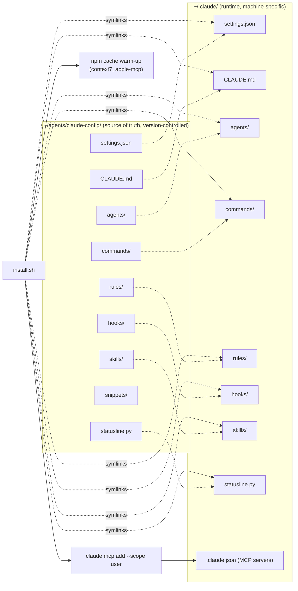

`settings.json` lives in the repo and is symlinked, so editing the runtime config means editing source. MCP servers are not symlinked — they're registered per machine via `claude mcp add --scope user` which writes to `~/.claude.json`.

---

## 3. Configuration Loading at Session Start

When you start `claude`, the harness loads configuration in a specific order and triggers SessionStart hooks before you can interact.

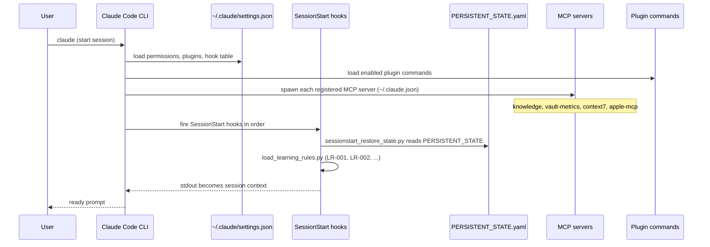

---

## 4. Issue → PR Pipeline (Orchestrate)

The full flow from a GitHub issue to a merged PR. Tier classification routes the work; some phases are conditional.

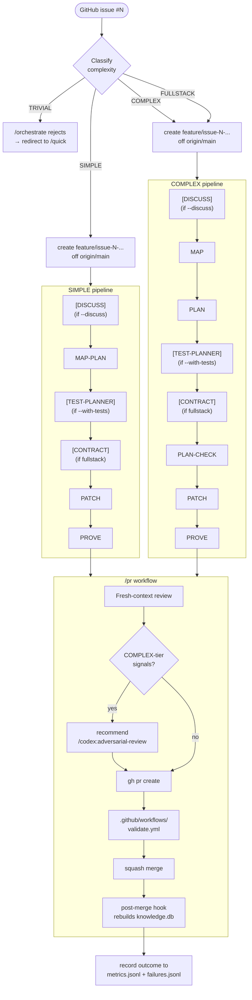

---

## 5. Tier Routing Decision Tree

Every task is classified by complexity. The routing is mostly deterministic; gray areas use `--discuss` to capture design decisions before MAP/PLAN runs.

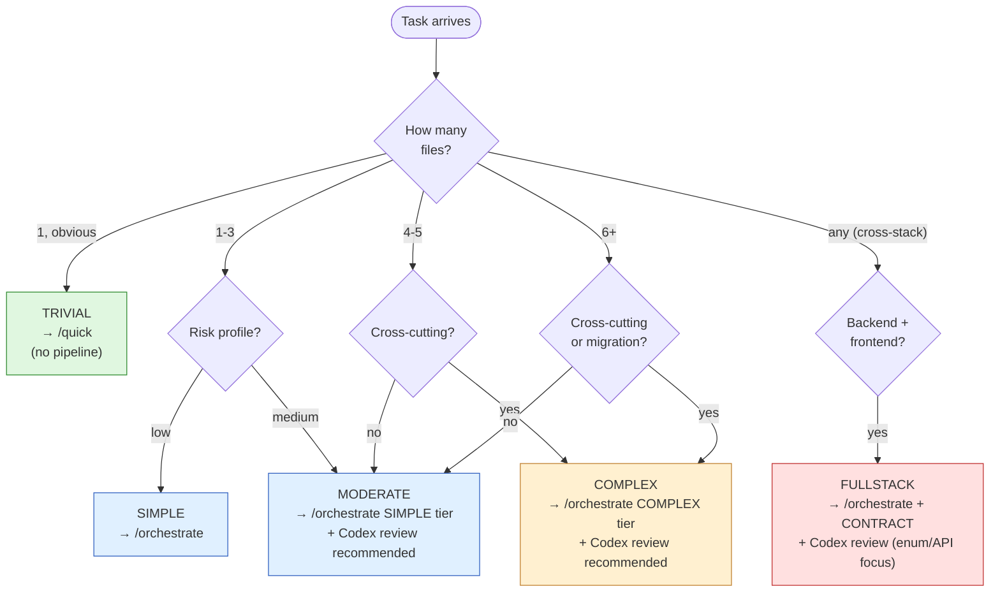

---

## 6. Hook Lifecycle

Hooks attach to specific Claude Code lifecycle events. Each hook is a Python script registered in `settings.json`.

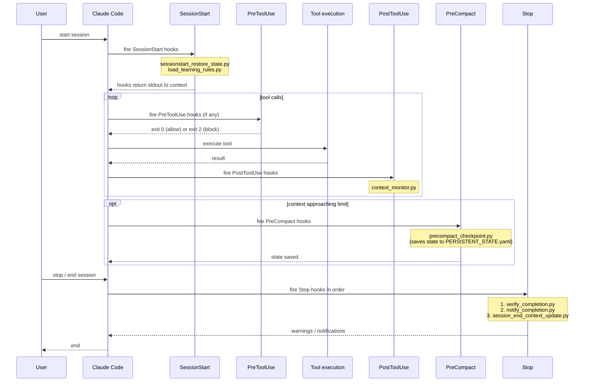

---

## 7. Self-Learning Loop

Every orchestrate outcome is recorded. Failures get root-cause classified, aggregated into patterns, and surface back through the agent pre-flight.

```mermaid
flowchart LR
    issue([Issue]) --> orchestrate[/orchestrate run]
    orchestrate --> outcome{"PROVE result"}

    outcome -- PASS --> metrics_pass["metrics.jsonl<br/>(success record)"]
    outcome -- BLOCKED --> failure_record["failures.jsonl<br/>(root_cause, files, prevention)"]
    outcome -- BLOCKED --> metrics_fail["metrics.jsonl<br/>(failure record)"]

    failure_record --> learn["/learn (weekly)"]
    metrics_pass --> learn
    metrics_fail --> learn

    learn --> patterns["knowledge/patterns/*.yaml<br/>(new + updated)"]
    learn --> rules["knowledge/learning_rules/<br/>(prevention rules)"]

    patterns --> sync[knowledge/sync.py build]
    rules --> sync
    sync --> db[(knowledge.db)]

    db --> mcp[vault-metrics MCP]
    mcp --> preflight[Agent pre-flight<br/>at next session start]

    preflight --> orchestrate

    classDef recordStyle fill:#fff0d0,stroke:#c08030
    classDef knowledgeStyle fill:#e0f0ff,stroke:#3060c0
    classDef agentStyle fill:#e0f7e0,stroke:#2d8a2d
    class metrics_pass,metrics_fail,failure_record recordStyle
    class patterns,rules,db,mcp knowledgeStyle
    class orchestrate,preflight agentStyle
```

---

## 8. MCP Server Topology

Five MCP servers extend Claude Code with structured tool APIs. Two are local processes from this repo; three come from npm packages.

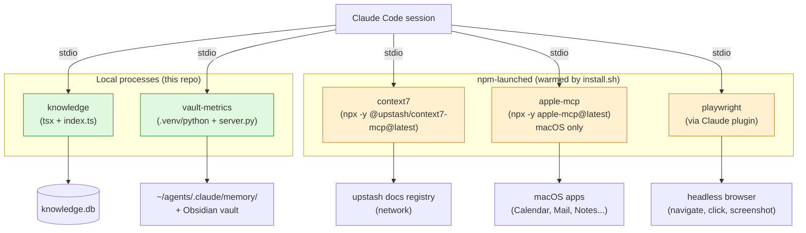

---

## 9. Knowledge Graph Data Flow

The knowledge graph is YAML files in git, built into a local SQLite database, surfaced to agents via the MCP server.

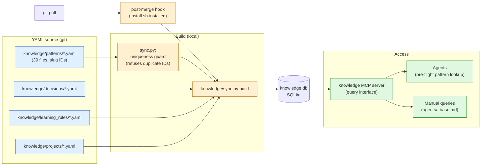

---

## 10. Codex × Claude Collaboration

Two AI models, complementary roles. Claude is the conductor; Codex is the second-opinion reviewer for risky work.

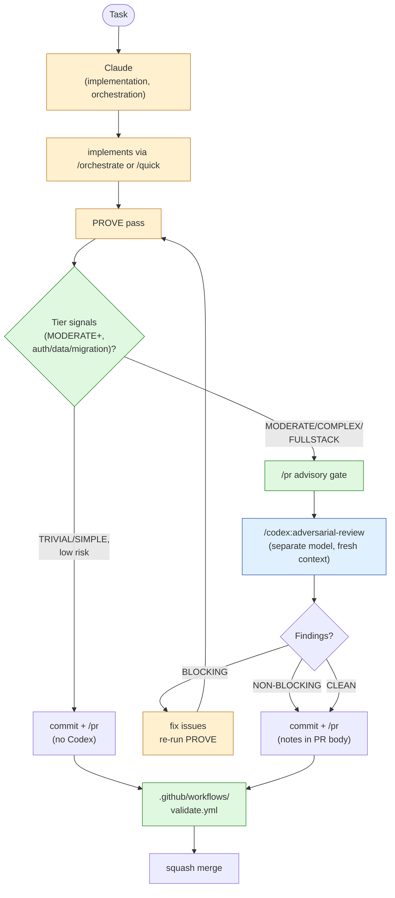

---

## 11. Multi-Machine Pattern Coordination

Pattern IDs use slugs derived from filenames. This makes multi-machine pattern authoring collision-free by construction — git's filename-uniqueness handles the coordination.

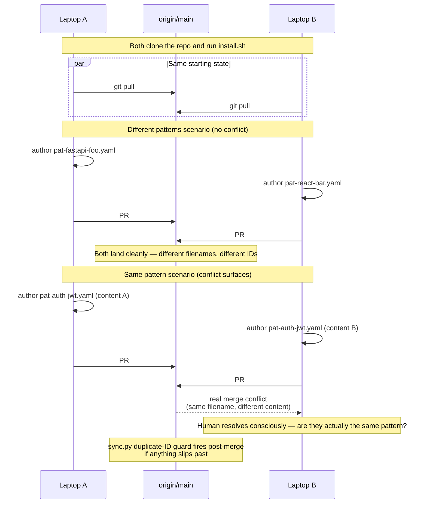

---

## 12. Pre-Merge Gate Stack

A PR passes through several gates before reaching `main`. Each gate catches a different class of regression.

```mermaid
flowchart TD
    branch[Feature branch<br/>committed + pushed]

    gate1[/pr command]
    branch --> gate1

    subgraph local_gates["Local-machine gates (in /pr)"]
        fresh["Pre-PR fresh-context review<br/>(pr-fresh-reviewer subagent)"]
        codex_check{"COMPLEX<br/>signals?"}
        codex_run["/codex:adversarial-review<br/>(advisory; user invokes)"]
    end

    gate1 --> fresh
    fresh --> codex_check
    codex_check -- yes --> codex_run
    codex_check -- no --> create_pr
    codex_run --> create_pr

    create_pr[gh pr create]

    subgraph ci_gates["GitHub Actions gates (.github/workflows/validate.yml)"]
        v_json["settings.json valid JSON"]
        v_bash["install.sh syntax (bash -n)"]
        v_hooks["validate-hooks.py<br/>(every hook script path resolves)"]
        v_sync["sync.py build<br/>(catches duplicate pattern IDs,<br/>schema drift)"]
        v_slug["pattern slug invariant<br/>(every id matches filename)"]
    end

    create_pr --> v_json
    v_json --> v_bash
    v_bash --> v_hooks
    v_hooks --> v_sync
    v_sync --> v_slug
    v_slug --> ready{"All<br/>green?"}

    ready -- no --> fail[block merge]
    ready -- yes --> merge[squash merge]

    merge --> postmerge["post-merge hook<br/>(rebuilds knowledge.db,<br/>re-runs install.sh if config changed)"]

    classDef localStyle fill:#fff0d0,stroke:#c08030
    classDef ciStyle fill:#e0f0ff,stroke:#3060c0
    classDef finalStyle fill:#e0f7e0,stroke:#2d8a2d
    class fresh,codex_check,codex_run localStyle
    class v_json,v_bash,v_hooks,v_sync,v_slug ciStyle
    class merge,postmerge finalStyle
```

---

## 13. Failure → Pattern Feedback Cycle

Detail of how a single failure becomes a prevention rule that future agents apply automatically.

```mermaid
flowchart LR
    failure([Agent fails PROVE])

    classify["Classify root cause<br/>(11 codes: ENUM_VALUE,<br/>COMPONENT_API, etc.)"]
    failure --> classify

    record["Append to failures.jsonl<br/>{root_cause, files, agent,<br/>prevention}"]
    classify --> record

    weekly["/learn (weekly)<br/>aggregate by root_cause"]
    record --> weekly

    threshold{"Frequency<br/>≥ threshold?"}
    weekly --> threshold

    threshold -- no --> hold[remain in failures.jsonl<br/>for next aggregation]
    threshold -- yes --> author["Author or update<br/>knowledge/patterns/<br/>pat-rootcause.yaml"]

    author --> review["Human review<br/>+ commit"]
    review --> sync[sync.py rebuild]
    sync --> mcp[vault-metrics MCP<br/>now exposes the pattern]

    mcp --> preflight[next agent pre-flight<br/>loads pattern automatically]
    preflight --> avoidance[future agents<br/>avoid the failure mode]

    classDef failStyle fill:#ffe0e0,stroke:#c03030
    classDef analysisStyle fill:#fff0d0,stroke:#c08030
    classDef knowledgeStyle fill:#e0f0ff,stroke:#3060c0
    classDef preventionStyle fill:#e0f7e0,stroke:#2d8a2d
    class failure,record failStyle
    class classify,weekly,threshold,author analysisStyle
    class sync,mcp knowledgeStyle
    class preflight,avoidance preventionStyle
```

---

## 14. State Continuity Across Sessions

Orchestrate workflows can span multiple sessions. State persists via the PreCompact and SessionStart hooks.

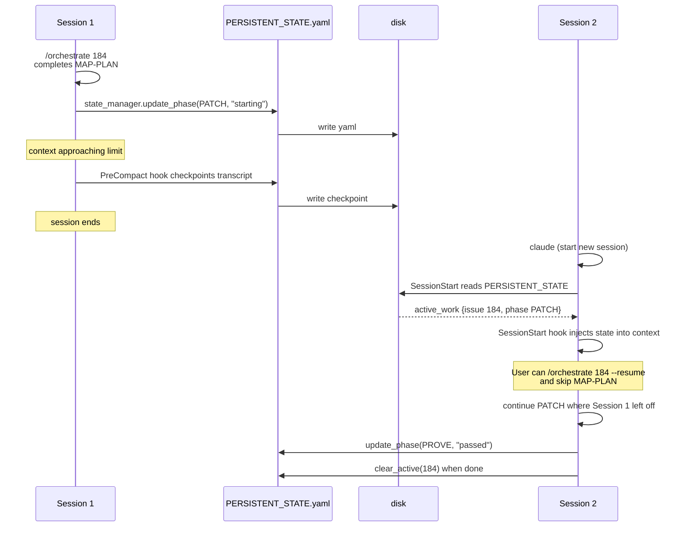

---

## 15. Slash Command Surface

The 16 user-facing slash commands grouped by purpose.

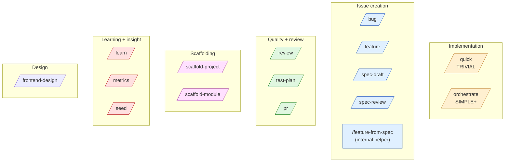

---

## Where to look next

- Pipeline phases in detail: [The Pipeline](../workflow/orchestrate.md)
- Agent definitions: [Agent Roles](../agents/overview.md)
- Hook contracts: [Hook Lifecycle](../hooks/lifecycle.md)
- Codex integration: [Codex Plugin](../integrations/codex-plugin.md)
- Self-learning system: [Self-Learning Loop](../learning/self-learning-loop.md)
- File-by-file inventory: [File Inventory](file-inventory.md)
